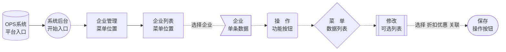

# 企业管理

### 新增企业

### 编辑企业

### 添加管理账户

### 添加下单账户

### 给企业绑定阶梯价格分组
> 系统中每个企业账号都需一个价格分组设置；如果没有设置则使用默认阶梯价格分组。

?> 若企业绑定某个阶梯价格组别后，该企业则以该价格分组中的价格体系进行价格计算。

### 给企业设置优惠定价分组

> 系统中每个企业账号都需一个优惠定价分组；如果没有设置则使用默认优惠定价分组。

?> 若企业选择了指定的优惠定价分组，该企业结算时将会按分组中关联的产品属性进行折扣计算。

### 相互关联功能

- [阶梯价格分组管理](/zh-cn/PricingSystem?id=阶梯价格分组)
- [优惠定价分组管理](/zh-cn/PricingSystem?id=优惠定价分组)

Document creation time:2021-12-17   Update time:{docsify-updated} 
 