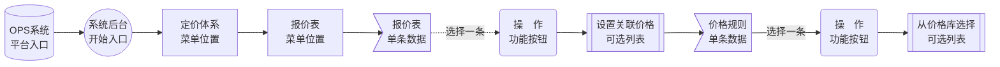

# 定价体系说明

?>定价体系的功能主要运用到批量订单价格计算以及充值折扣发放。

------

## 阶梯价格分组

> 阶梯价格分组可以将不同的企业客户进行不同的阶梯分组报价。

#### 应用示例

1. 例如有2个阶梯价格分组，价格分`组1` 的报价是1-99份 每张1元。`分组2`的报价1-99份每张0.9元。
2. 有A,B,C,D四个客户，我们将A,B客户为`分组1`、C,D客户为`分组2`，在同一个产品将执行不同的价格阶梯报价方式。
3. 如果当前用户没有特定分组，就会获取默认的价格组。

提示：系统会有一个默认阶梯价格分组。

#### 报价示例

阶梯价格分组报价示意

----

### 添加阶梯价格分组

操作路径

提示：系统只允许有一个默认阶梯价格分组，如设置当前为默认后，以前默认价格分组会自动取消。

##### 添加阶梯价格分组截图

<!-- tabs:start -->
<!-- tab:阶梯价格分组列表 -->

<!-- tab:新增阶梯价格表单 -->

<!-- tabs:end -->

----

### 编辑阶梯价格分组

操作路径

提示：系统只允许有一个默认阶梯价格分组，如设置当前为默认后，以前默认价格分组会自动取消。

##### 编辑阶梯价格分组截图

<!-- tabs:start -->

<!-- tab:阶梯价格分组列表 -->

<!-- tab:编辑阶梯价格分组表单 -->

<!-- tabs:end -->

----

### 价格分组相互联功能

- [在阶梯价格中绑定价格分组](/zh-cn/PricingSystem?id=绑定阶梯价格分组)

- [在企业账户中绑定价格分组](/zh-cn/BusinessManagement?id=给企业绑定阶梯价格分组)

----

## 价格库

> 建立一个常规阶梯报价表数据库存储库；以便价格表中设置中价格规则可进行价格库关联导入。

#### 应用示例

1. 价格库是怎么组成的？

   是指将常规与使用率高的报价进行组合。

   例：将 **A材料**+**B颜色**+**C机型** 组合成一个阶梯报价组，那么我们就先根据这个阶梯设置一个价格表记录在价格库内。

2. 它给谁提供服务？

   2-1、在管理报价表中可以从默认价格库选择，而不用重复录入。

   2-2、在管理报价表[使用Excel导入导出绑定价格库](/zh-cn/PricingSystem?id=使用excel导入导出绑定价格库)进行关联。

----

### 添加价格库

操作路径

<!-- tabs:start -->
<!-- tab:价格库列表截图 -->

<!-- tab:价格库添加截图 -->

<!-- tabs:end -->

----

### 编辑价格库

操作路径

<!-- tabs:start -->
<!-- tab:价格库列表截图 -->

<!-- tab:价格库编辑截图 -->

<!-- tabs:end -->

----

### 价格库阶梯报价

#### 添加阶梯报价

操作路径

阶梯报价表单详细说明参见：[设置阶梯价格](/zh-cn/TopicAdditionalTable?id=设置阶梯价格)
<!-- tabs:start -->
<!-- tab:价格库列表截图 -->

<!-- tab:阶梯报价列表截图 -->

<!-- tab:阶梯报价表单截图 -->

<!-- tabs:end -->

#### 编辑阶梯报价

操作路径

阶梯报价表单详细说明参见：[设置阶梯价格](/zh-cn/TopicAdditionalTable?id=设置阶梯价格)
<!-- tabs:start -->
<!-- tab:价格库列表截图 -->

<!-- tab:阶梯报价列表截图 -->

<!-- tab:阶梯报价表单截图 -->

<!-- tabs:end -->

### 价格库相互关联功能

- [报价表中关联价格库](/zh-cn/PricingSystem?id=绑定阶梯价格分组)
- [在Excel绑定价格库](/zh-cn/PricingSystem?id=excel导入导出)

----

## 优惠定价分组

> 优惠分组是指可设置不同价格折扣组，可以更灵活的控制不同企业客户所享受的价格优惠。

#### 应用示例

优惠分组以折扣发放可大大刺激企业客户参与充值，提高运营盈收及成交量。

一些预存客户或者大客户可以设置新的分组，在结算时可以在原价的基础上可进行打折。

例：某客户所在的分组为 `分组2`，分组2的折扣设置为`6折`。

#### 结算示意

优惠分组结算逻辑示意

----

### 优惠定价分组表单说明

| 项目         | 说明                                         | 备注                       |
| ------------ | -------------------------------------------- | -------------------------- |
| 名称         | 优惠分组命名，自定义方便自己记忆与使用。     |                            |
| 是否默认     | 设置默认后，所有人默认此优惠分组。           | 只允许一个默认             |
| 产品属性     | 所应用的产品属性，选择后则为指定的属性有效。 | `不选择则应用于全部属性`。 |
| 应用数量范围 | 前台下单在指定的订购范围才有效。             |                            |
| 类型         | 目前只应用到员工账号。                       |                            |
| 折扣         | 折扣比例。                                   | 1折 0.1  、8.8折0.88       |

### 添加优惠定价分组

操作路径

以下表单说明详见：[添加优惠定价分组表单说明](zh-cn/PricingSystem?id=优惠定价分组表单说明)

<!-- tabs:start -->

<!-- tab:添加优惠定价分组后台截图 -->

<!-- tabs:end -->

### 编辑优惠定价分组

操作路径

以下表单说明详见：[编辑优惠定价分组表单说明](zh-cn/PricingSystem?id=优惠定价分组表单说明)

<!-- tabs:start -->

<!-- tab:编辑优惠定价分组后台截图 -->

<!-- tabs:end -->

### 定价分组相互关联功能

- [给企业设置优惠定价分组](/zh-cn/BusinessManagement?id=给企业设置优惠定价分组)

------

## 报价表

> 价格表是根据产品或者产品相关连的工艺及自定义属性进行关联**组合**制定为**定价体系**规则称之为**多维度**组合报价。

#### 应用示例

举例：根据需求进行对 【纸张尺寸+颜色+纸张克重+单双面】产品工艺进行创建多维度组合**报价单**。

当客户下单时选择

`纸张尺寸：xx*xx`

`颜色：xx`

`纸张厚重：xxg`

`单双面：x面`

就会触发这个报价体系[关联价格](/zh-cn/PricingSystem?id=管理报价表：设置关联价格规则)对应属性的[价格规则](/zh-cn/PricingSystem?id=管理关联产品属性功能示意)中[阶梯价格](/zh-cn/PricingSystem?id=阶梯价格说明)。

#### 报价示例

报价表费用计算功能示意

----

### 添加报价表

操作路径

添加表单说明

| 项目     | 说明                                                         | 备注                              |
| ---- | ---- | ---- |
| 产品 | 选择所关联的产品 |      |
| 产品属性 | 所关联的产品属性 | 最少关联1一个属性，可以选择多个(进行多维度)报价 |
| 名称 | 定义当前所设置的报价表名称 | 自定义，方面自己区分报价信息 |
| 类型 | 默认即可 | |

<!-- tabs:start -->

<!-- tab:添加报价表后台截图 -->

<!-- tabs:end -->

### 编辑报价表

操作路径

编辑表单说明

| 项目     | 说明                                                         | 备注                              |
| ---- | ---- | ---- |
| 产品 | 选择所关联的产品 |      |
| 产品属性 | 所关联的产品属性 | 最少关联1一个属性，可以选择多个(进行多维度)报价 |
| 名称 | 定义当前所设置的报价表名称 | 自定义，方面自己区分报价信息 |
| 类型 | 默认即可 | |

<!-- tabs:start -->

<!-- tab:编辑报价表后台截图 -->

<!-- tabs:end -->

----

### 绑定阶梯价格分组

操作路径

> 可同时绑定多个阶梯价格组，建议绑定1个。

?> 绑定后所应用到当前阶梯价格组客户将适配此阶梯价格。

<!-- tabs:start -->

<!-- tab:编辑报价表后台截图 -->

<!-- tabs:end -->

### 关联价格库

操作路径

从价格库选择关联，如下图；选择后点击确定则自动把价格表中的数据导入当前价格规则。
<!-- tabs:start -->

<!-- tab:关联后台截图 -->

<!-- tabs:end -->

### 什么是价格规则

> 价格规则即：[阶梯价格](/zh-cn/PricingSystem?id=什么是阶梯价格)列表，也就是当前价格表所绑定产品属性对应的属性值。

例如：纸张类型所涉及的阶梯价格信息

?> 下面每个纸张类型可以设置多个阶梯价格。比如订购数量1-10是阶梯价1、数量11-100是阶梯价2、数量101-19999是阶梯价N……

关联逻辑功能示意

### 什么是阶梯价格

> 阶梯价格可根据指产品的订单量等相关信息进行灵活报价。可关联[阶梯价格分组](/zh-cn/PricingSystem?id=阶梯价格分组)进行灵活运用。

阶梯价格功能是为了让商家更方便控制自定义报价的每项细节，可进行分组档位分门别类设置；

例如：印刷1张、10张、100张与印刷1000张彩页报价不同。

可以根据需求设置订购量、页数进行按份数、面积、尺寸等方式进行智能报价，进行成本控制实现利润最大化。

**延伸：**

- [阶梯价格公式说明](/zh-cn/TopicAdditionalTable?id=计价公式说明)
- [手动添加阶梯价格](/zh-cn/PricingSystem?id=添加阶梯价格)
- [Excel导入阶梯价格](/zh-cn/PricingSystem?id=excel导入导出)
- [从价格库导入阶梯价格](/zh-cn/PricingSystem?id=关联价格库)

<!-- tabs:start -->

<!-- tab:后台阶梯价格列表截图 -->

<!-- tabs:end -->

### 添加阶梯价格

操作路径

参数设置说明参见：[设置阶梯价格](/zh-cn/TopicAdditionalTable?id=设置阶梯价格)

<!-- tabs:start -->
<!-- tab:阶梯价格设置截图 -->

<!-- tabs:end -->

### 编辑阶梯价格

操作路径

参数设置说明参见：[设置阶梯价格](/zh-cn/TopicAdditionalTable?id=设置阶梯价格)

<!-- tabs:start -->
<!-- tab:阶梯价格设置截图 -->

<!-- tabs:end -->

### Excel导入导出

#### 导出Excel

操作路径

打开下载的Execl，然后从[价格库](/zh-cn/PricingSystem?id=价格库)中的[阶梯价格名称](/zh-cn/PricingSystem?id=添加价格库)进行复制，然后称粘贴到Execl表第五列【绑定价格库】相应属性的位置即可。

<!-- tabs:start -->
<!-- tab:Excel关联示意图 -->

<!-- tabs:end -->

#### 导入Excel

操作路径

关联后保存Excel文件，然后将所下载的**报价表**选择【导入Excel】即可自动批量处理。

### 报价表相互关联功能

- [如何创建一个报价表](/zh-cn/TopicQuickPrint-SetProductQuotesFromZero)

Document creation time:2021-12-17   Update time:{docsify-updated} 
 