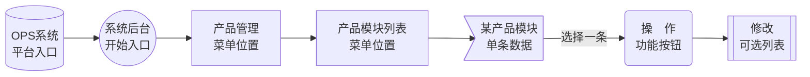

# 产品管理系统

高度DIY定制化产品管理体系，可自由组合各项需求的产品功能模式。

------


## 产品模块列表

> 产品模块大部分应用到[影像产品](/zh-cn/TopicCostRelated?id=影像产品)较多，用于商城展示套系分类。
> [快印产品](/zh-cn/TopicCostRelated?id=快印产品)根据定制化需求也会用到产品模块区分。

### 模块应用展示

<!-- tabs:start -->
<!-- tab:产品模块前台应用展示 -->


<!-- tab:系统后台产品模块列表 -->


<!-- tabs:end -->


### 添加产品模块

操作路径


添加表单说明

| 项目     | 说明             | 备注             |
| -------- | ---------------- | ---------------- |
| 排序号   | 位置排序         | 数字，越小越靠前 |
| 名称     | 前台展示名称     |                  |
| 图片     | 前台展示图标     |                  |
| 是否显示 | 不选择为前台隐藏 |                  |

<!-- tabs:start -->
<!-- tab:产品模块后台列表 -->


<!-- tab:添加产品模块表单 -->


<!-- tabs:end -->

### 编辑产品模块

操作路径



编辑表单说明

| 项目     | 说明             | 备注             |
| -------- | ---------------- | ---------------- |
| 排序号   | 位置排序         | 数字，越小越靠前 |
| 名称     | 前台展示名称     |                  |
| 图片     | 前台展示图标     |                  |
| 是否显示 | 不选择为前台隐藏 |                  |

<!-- tabs:start -->
<!-- tab:编辑产品模块列表 -->


<!-- tab:编辑产品模块表单 -->


<!-- tabs:end -->

------


## 产品分类列表

> 产品分类大部分应用到[影像产品](/zh-cn/TopicCostRelated?id=影像产品)较多，用于商城展示套系中的商品分类。
> [快印产品](/zh-cn/TopicCostRelated?id=快印产品)根据定制化需求也会用到产品分类区分。

### 分类应用展示

<!-- tabs:start -->
<!-- tab:分类前台展示截图 -->


<!-- tab:分类后台列表截图 -->


<!-- tabs:end -->

### 添加产品分类

操作路径


表单说明

| 项目     | 说明             | 备注             |
| -------- | ---------------- | ---------------- |
| 排序号   | 位置排序         | 数字，越小越靠前 |
| 名称     | 前台展示名称     |                  |
| 所属模块 | 所属上级产品模块 |                  |
| 内容     | 产品分类描述     |                  |
| 是否显示 | 不选择为前台隐藏 |                  |

<!-- tabs:start -->
<!-- tab:产品分类列表截图 -->


<!-- tab:添加产品分类表单 -->


<!-- tabs:end -->

### 编辑产品分类

操作路径


表单说明

| 项目     | 说明             | 备注             |
| -------- | ---------------- | ---------------- |
| 排序号   | 位置排序         | 数字，越小越靠前 |
| 名称     | 前台展示名称     |                  |
| 所属模块 | 所属上级产品模块 |                  |
| 内容     | 产品分类描述     |                  |
| 是否显示 | 不选择为前台隐藏 |                  |

<!-- tabs:start -->
<!-- tab:产品分类列表截图 -->


<!-- tab:编辑产品分类表单 -->


<!-- tabs:end -->


------


## 产品属性
> 产品属性大部分应用到[快印产品](/zh-cn/TopicCostRelated?id=快印产品)较多，用于自定义下单中的各项工艺、属性、参数展示。

### 产品属性介绍

主要作用：

1. 产品属性应用于系统前台提交产品订单时所需的表单项目，参见[前台应用展示](/zh-cn/ProductManagement?id=前台应用展示)图。

2. 产品属性是OPS系统与TFLow系统沟通的桥梁，产品属性就像是发向[TFLow系统](/zh-cn/TFLow)的各种指令信息。

配合[前台应用展示](/zh-cn/ProductManagement?id=前台应用展示)图的工作逻辑如下


### 前台应用展示

<!-- tabs:start -->
<!-- tab:产品属性前台应用截图 -->


<!-- tabs:end -->


### 添加产品属性

操作路径


产品属性表单说明见：[产品属性表单](/zh-cn/TopicAdditionalTable?id=产品属性表单)

<!-- tabs:start -->
<!-- tab:产品属性列表 -->


<!-- tab:添加产品属性表单 -->


<!-- tabs:end -->


### 编辑产品属性

操作路径


产品属性表单说明见：[产品属性表单](/zh-cn/TopicAdditionalTable?id=产品属性表单)

<!-- tabs:start -->
<!-- tab:编辑产品属性列表 -->


<!-- tab:编辑产品属性表单 -->


<!-- tabs:end -->


### 什么是产品属性信息

产品属性信息是每个[产品属性](/zh-cn/ProductManagement?id=产品属性介绍)的子项，有1个或N多个信息组成。有些[产品属性](/zh-cn/ProductManagement?id=产品属性介绍)可以没有属性信息。

举例1：产品属性`采购数量`属于输入信息，可以没有属性信息。

举例2：产品属性`纸张类型`属于选择项，属性信息可以有多条；比如：铜版纸、哑粉纸、白卡纸、皮纹纸……


### 添加产品属性信息

操作路径


属性信息表单说明见：[产品属性信息表单](/zh-cn/TopicAdditionalTable?id=产品属性信息表单)

<!-- tabs:start -->
<!-- tab:某产品属性信息列表 -->


<!-- tab:添加产品属性信息表单 -->


<!-- tabs:end -->

### 编辑产品属性信息

操作路径


属性信息表单说明见：[产品属性信息表单](/zh-cn/TopicAdditionalTable?id=产品属性信息表单)

<!-- tabs:start -->
<!-- tab:快递产品属性信息列表 -->


<!-- tab:编辑产品属性信息表单 -->


<!-- tabs:end -->


------


## 产品列表

### 添加产品

操作路径


新增产品表单说明见：[商品基础信息表单](/zh-cn/TopicAdditionalTable?id=商品基础信息表单)

<!-- tabs:start -->
<!-- tab:产品列表 -->

参见下图 ① 添加


<!-- tab:新增产品表单 -->


<!-- tabs:end -->

### 编辑产品

操作路径


编辑产品表单说明见：[商品基础信息表单](/zh-cn/TopicAdditionalTable?id=商品基础信息表单)

<!-- tabs:start -->
<!-- tab:编辑产品列表 -->

参见下图 ② 修改


<!-- tab:编辑产品表单 -->


<!-- tabs:end -->

### 复制产品

> 是将被复制的产品数据信息拷贝一份作为新的产品。


操作路径


<!-- tabs:start -->
<!-- tab:管理产品列表-复制 -->

参见下图 ③ 拷贝


<!-- tab:复制产品表单 -->

在`产品名称`中设置新的产品名称


<!-- tabs:end -->

### 下架产品

> 下架后前台无法显示对应的产品。

操作路径


<!-- tabs:start -->
<!-- tab:管理产品列表-下架 -->

参见下图 ④ 下架


<!-- tabs:end -->

### 上架产品

> 将下架的重新销售，前台可见。

操作路径


<!-- tabs:start -->
<!-- tab:管理产品列表-上架 -->

参见下图 ④ 上架


<!-- tabs:end -->

### 商品图片

> 前台商品多图片展示，配合[商品基础信息](/zh-cn/ProductManagement?id=添加产品)中的封面，大多用于[影像产品](/zh-cn/TopicCostRelated?id=影像产品)。

操作路径


<!-- tabs:start -->
<!-- tab:管理产品列表-商品图片 -->

参见下图 ⑥ 商品图片


<!-- tab:商品图片管理 -->


<!-- tab:商品图片前台展示 -->

根据网站模板不同显示的位置也不同。


<!-- tabs:end -->

### 产品规格

> 产品规格主要用于[影像产品](/zh-cn/TopicCostRelated?id=影像产品)的规格选择应用。

操作路径


<!-- tabs:start -->
<!-- tab:管理产品列表-产品规格 -->

参见下图 ⑦ 产品规格


<!-- tab:产品规格管理列表 -->

这里可以增加和编辑产品规格信息。


<!-- tab:产品规格管理表单 -->

产品规格表单信息说明见：[规格与套系后台管理](/zh-cn/TopicAdditionalTable?id=规格与套系后台管理)


<!-- tab:产品规格前台展示 -->

根据网站模板不同显示的位置也不同。


<!-- tabs:end -->

#### 设置产品规格代理商价格

操作路径


<!-- tabs:start -->

<!-- tab:产品规格列表 -->

选择③ 设置理商价格


<!-- tab:产品规格代理商列表 -->


<!-- tab:产品规格代理商设置 -->


<!-- tabs:end -->

### 套系子产品

> 套系子产品主要用于[影像产品](/zh-cn/TopicCostRelated?id=影像产品)的套系选择应用。

操作路径


<!-- tabs:start -->
<!-- tab:管理产品列表-套系子产品 -->

在发布[添加产品](/zh-cn/ProductManagement?id=添加产品)中的**类型**选择**套系产品**对应的产品中[产品规格](/zh-cn/ProductManagement?id=产品规格)设置位置就会是套系子产品的设置。

参见下图 ⑦ 套系子产品


<!-- tab:套系子产品管理列表 -->

这里可以增加和编辑产品规格信息。


<!-- tab:套系子产品管理表单 -->

套系子产品表单信息说明见：[规格与套系后台管理](/zh-cn/TopicAdditionalTable?id=规格与套系后台管理)


<!-- tab:套系子产品前台展示 -->

根据网站模板不同显示的位置也不同。


<!-- tabs:end -->

#### 设置套系产品代理商价格

操作路径


<!-- tabs:start -->

<!-- tab:套系产品列表 -->

选择③ 设置理商价格


<!-- tab:套系产品代理商列表 -->


<!-- tab:套系产品代理商设置 -->


<!-- tabs:end -->

### 自定义属性

> 在发布[添加产品](/zh-cn/ProductManagement?id=添加产品)中的**类型**选择**自定义产品** 时有此设置。

#### 自定义属性介绍

> 自定义属性是整个[快印类](/zh-cn/TopicCostRelated?id=快印产品)产品的核心设置项

产品自定义属性中进行关联[产品属性](/zh-cn/ProductManagement?id=产品属性介绍)，在关联产品属性可设置多层级关联关系以及条件。

在前台产品下单时每选择一个产品属性都根据所关联的产品属性进行匹配，参见：[前台应用展示](/zh-cn/ProductManagement?id=前台应用展示)截图的纸张类型；当选择铜版纸时会关联其子信息。

后台设置参见：[设置自定义属性](/zh-cn/ProductManagement?id=设置自定义属性)中的**自定义属性管理**截图。

#### 设置自定义属性

操作路径


<!-- tabs:start -->
<!-- tab:管理产品列表-自定义属性 -->

参见下图 ⑧ 自定义属性


<!-- tab:自定义属性管理 -->

| 项目 | 说明                                                         | 备注                   |
| ---- | ------------------------------------------------------------ | ---------------------- |
| ①    | 当前产品                                                     | 属于1级节点            |
| ②    | 点击`对应属性`后再点`编辑属性`，可进行当前属性信息管理与调整 |                        |
| ③    | 添加关联属性                                                 |                        |
| ④    | 点击`⑦`连线时会在此显示上级节点的属性，在此进行选择进入当前属性节点的条件。 | 进入连线属性节点的条件 |
| ⑤    | 2级节点                                                      |                        |
| ⑥    | 所添加后的属性节点                                           |                        |
| ⑦    | 上级与下级的串联连线，配合`④`控制进入条件。                  |                        |


<!-- tabs:end -->

#### 自定义属性设置连线与表单

进入[设置自定义属性](/zh-cn/ProductManagement?id=设置自定义属性)后，根据在所对应的连线与表单(属性)进行说明。

<!-- tabs:start -->
<!-- tab:节点属性 -->

> 通过编辑属性或添加属性会有如下截图，表单说明见：[自定义属性表单说明](/zh-cn/TopicAdditionalTable?id=产品自定义属性表单)


<!-- tab:连线设置 -->

> 可根据需求进行连线关联数据，关联条件可选。


<!-- tab:自定义属性操作示范 -->


<!-- tabs:end -->

### 设置产品属性

> 在发布[添加产品](/zh-cn/ProductManagement?id=添加产品)中的**类型**选择**基础商品、套系产品** 时有此设置。

操作路径

```mermaid
graph LR
   0[(OPS系统 <div class='os'>平台入口</div>)]-->A((系统后台 <div class='in'>开始入口</div>))
   A-->B[产品管理<div class='menu'>菜单位置</div>]
   B-->C[产品列表<div class='menu'>菜单位置</div>]
   C-->D>某产品<div class='one'>单条数据</div>]
   D-->|选择一条|E(操　作<div class='button'>功能按钮</div>)
   E-->F[[设置产品属性 <div class='opt'>可选列表</div>]]
```

<!-- tabs:start -->
<!-- tab:管理产品列表-设置产品属性 -->

参见下图 ⑧ 设置产品属性


<!-- tab:设置产品属性 -->


<!-- tab:产品属性前台展示 -->

> 例如设置关联后了**颜色**为`金色``银色`前台对应产品中会有如下图的`颜色`选项。


<!-- tabs:end -->

### 商品分配给供应商

> 将指定的产品有指定的供应商进行生产，完善工业化细节分配。

操作路径

```mermaid
graph LR
   0[(OPS系统 <div class='os'>平台入口</div>)]-->A((系统后台 <div class='in'>开始入口</div>))
   A-->B[产品管理<div class='menu'>菜单位置</div>]
   B-->C[产品列表<div class='menu'>菜单位置</div>]
   C-->D>某产品<div class='one'>单条数据</div>]
   D-->|选择一条|E(操　作<div class='button'>功能按钮</div>)
   E-->F[[商品分配给供应商 <div class='opt'>可选列表</div>]]
```

<!-- tabs:start -->
<!-- tab:管理产品列表-分配给供应商 -->

参见下图 ⑨ 自定义属性


<!-- tab:设置分配给供应商 -->


<!-- tabs:end -->

### 商品分配给代理商

> 将指定的产品分配给特定的代理商销售，可避免内部竞争的同时也可以针对性的拓展。

操作路径

```mermaid
graph LR
   0[(OPS系统 <div class='os'>平台入口</div>)]-->A((系统后台 <div class='in'>开始入口</div>))
   A-->B[产品管理<div class='menu'>菜单位置</div>]
   B-->C[产品列表<div class='menu'>菜单位置</div>]
   C-->D>某产品<div class='one'>单条数据</div>]
   D-->|选择一条|E(操　作<div class='button'>功能按钮</div>)
   E-->F[[商品分配给代理商 <div class='opt'>可选列表</div>]]
```

<!-- tabs:start -->
<!-- tab:管理产品列表-分配给代理商 -->

参见下图 ⑩ 自定义属性


<!-- tab:设置分配给代理商 -->


<!-- tabs:end -->

### 商品分配企业

> 可将产品推送给针对企业客户使用，专业化服务。

操作路径

```mermaid
graph LR
   0[(OPS系统 <div class='os'>平台入口</div>)]-->A((系统后台 <div class='in'>开始入口</div>))
   A-->B[产品管理<div class='menu'>菜单位置</div>]
   B-->C[产品列表<div class='menu'>菜单位置</div>]
   C-->D>某产品<div class='one'>单条数据</div>]
   D-->|选择一条|E(操　作<div class='button'>功能按钮</div>)
   E-->F[[商品分配企业 <div class='opt'>可选列表</div>]]
```

<!-- tabs:start -->
<!-- tab:管理产品列表-分配给企业 -->

参见下图 ⑪ 自定义属性


<!-- tab:设置分配给企业 -->


<!-- tabs:end -->


<p align="right">Document creation time:2021-12-20   Update time:{docsify-updated} </p> 