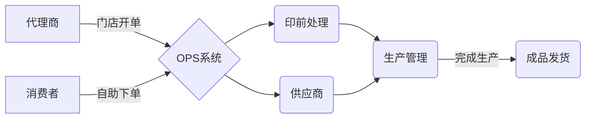

## 系统介绍

> 领先的一站式网络印刷系统解决方案，全自动智能快速印刷！

​       一站式印刷系统（Online printing shop ）是由《[广州多普网络科技有限公司](http://www.deepmind.cn/)》历时多年研发经营，是面向印刷行业软件整体解决方案的一款产品。

广州多普全流程解决方案，从网络接单，到印前自动化再到供应链管理，一气呵成，让印刷更简单 ！

### 系统优势

> OPS领先的响应式自助下单平台，自助报价，在线编辑，订单管理，迅速提升您的客户下单体验。

**客户自助下单**

比传统QQ下单节省90%时间，客户自助浏览数百款产品，不需要占用客服的宝贵时间；

**全天运行**

比起传统的QQ下单模式，在线自助下单能全天候7x24小时运转，下班时间，客户也能完成交易，大大增加了销量。

**客户管理**

不同客户有不同的价格体系，产品归类，每一个产品以及价格都是为顾客量身定做，提高客户满意度。

**无缝对接Tflow印前自动化**

接单后无缝对接Tflow印前自动化，针对不同产品自动用不同的印前处理方式。

**全球在线**

支持数十种不同国家的语言，可以让说不同语言的客户都可以达成交易；

**5x8小时远程售后支持** 

利用远程操作工具，提供协助，帮助客户进行调试、解决故障。

**门店线下开单**

针对门店来的上门客户，客服人员可以现场开单，相当于ERP系统的内部开单。

**询价管理**

非标准产品，大批量订购的产品，客户可能需要询价，通过询价管理，可以管理整个一来一回的询价过程，不遗漏一单生意。 

**支持多种产品**

支持册子，单页，名片，折页Tshirt等产品；

**自动邮件通知**

下单后可以生成订单后，并发送通知给客户，订单状态的改变，也可以发送邮件通知给客户；

**内部交接班留言**

交接班时以前需要写纸质的工作日志，现在可以在系统里面把订单历史，发生过的事情记录在订单历史里面，方便不同人员的交接；

**后台角色权限管理**

不同的后台管理人员可以看到不同的内容，如财务只能看到财务相关的内容，生产人员只能看到生产相关的内容；

**B2B大客户专区**

大客户拥有专属的登录画面，专属的产品以及价格体系；

**身份验证**

提供HTTPS的登录链接，让服务更安全；

**高效编辑**

在线编辑器可以让客户直接编辑模版的内容，提供所见即所得的服务；

**客户不用通过电话查询状态**

订单状态一目了然，客户不再需要打电话问状态。

### 应用场景

> 一款有生命力的软件，在于可以适应不同的应用场景

- 不干胶标签印前自动化方案
- 婚纱影楼影像生产方案
- 个人影像产品生产中心解决方案
- 个性化包装行业应用
- 大幅面印刷行业应用
- 快印印前自动化方案
- 服装吊牌印前自动化应用
- 支付码印前自动化应用
- 按需出版应用
- .......

------

## 公司介绍

广州多普是大中华区领先的印刷行业软件整体解决方案供应商；

广州多普一直致力于帮助大中华区数字印刷客户整合世界上先进的流程方案。

方案包括云印刷平台，个性化相册平台，印前自动化平台等，已成功将国外的先进流程应用到超过一百多家的中国数字印刷商中。

###### HP亚太区战略合作伙伴

广州多普网络科技有限（Deepmind solutions)公司为美国惠普公司在亚太区的解决方案合作伙伴，为众多大中华区的HP Indigo客户提供整体的IT解决方案。持续十年为高端的印刷企业提供一体化的IT解决方案，在高端市场占有率领先。

###### 德国Aristo-Engview亚太区研发中心

广州多普网络科技有限（Deepmind solutions)公司为d德国切割机巨头Aristo及其软件公司Engview solutions 在亚太区的研发中心，承担其在亚太区的区域化软件二次开发的研发任务。为亚太区的本地客户提供更多定制化的二次开发服务。 

###### 国家认证高新技术企业

高新技术企业是指通过科学技术或者科学发明在新领域中的发展，或者在原有领域中革新似的运作。在界定高新技术产业范围的基础上，对于高新技术企业的概念问题可以从2016 年国家修订印发的《高新技术企业认定管理办法》来加以界定。因此，在我国，高新技术企业一般是指在国家颁布的《国家重点支持的高新技术领域》范围内，持续进行研究开发与技术成果转化，形成企业核心自主知识产权，并以此为基础开展经营活动的居民企业，是知识密集、技术密集的经济实体。 

Document creation time:2021-12-08   Update time:{docsify-updated} 
 