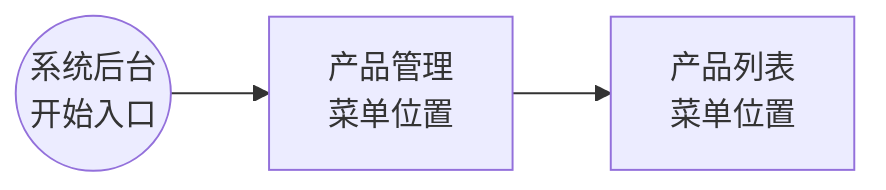
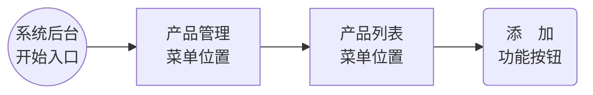
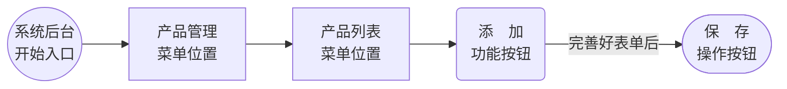
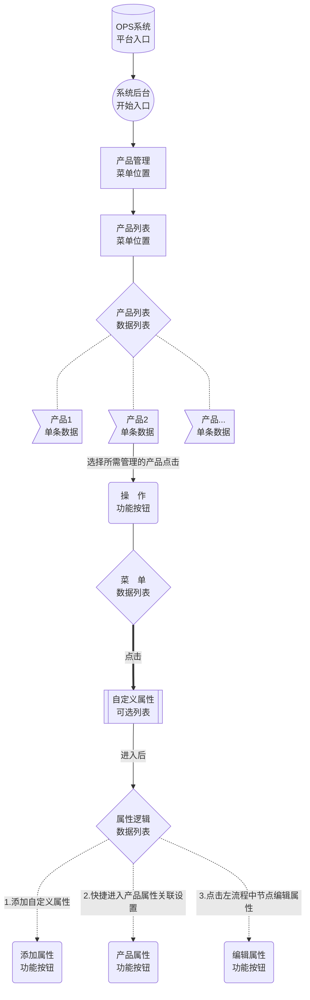

## 文档阅读指引

### 注解说明
> 一些名词、功能使用、描述或行业用语会在对应的字词中增加链接。

**例如：**

[DSS](/zh-cn/StartGuideMustRead?id=dss)套筒式技术为柔性印刷注入新活力。

在包装或装饰性印刷品中，常遇到一些花样设计满版重覆一致，又可随意裁切下来，而两端对接看不出接缝的要求，这在单色印刷机上，不论胶印或柔印，都是难以办到的。在卷筒式印刷机上虽能办到，但如果用单块式印版装到印版滚筒上去印刷，要做到印品看不出接缝，也同样是一件很困难的事。

单色如此，彩色就更困难。

###### DSS

DDS是指：(Digital Seamless Sleeves) 数字化无接缝套筒式印版。

### 图例说明

#### 展现形式

<!-- tabs:start -->

<!-- tab:连线说明 -->

| 形式     | 说明                                          | 图示                                                         |
| -------- | --------------------------------------------- | ------------------------------------------------------------ |
| 普通连线 | 下级或分类 `例如：客户种类、产品分类`         |  |
| 普通箭头 | 常规走向 `例如：产品管理->产品列表`           |  |
| 加粗连线 | 特别下级与分类 `重要或提示`                   |  |
| 加粗箭头 | 特别走向 `重要或提示`                         |  |
| 虚线连线 | **设想或假设**的下级或分类 `例如：假如、举例` |  |
| 虚线箭头 | **设想或假设**的走向                          |  |

<!-- tab:形状说明 -->

| 形状           | 功能说明                                                     | 形状图示                                                     | 示范                                                      |
| -------------- | ------------------------------------------------------------ | ------------------------------------------------------------ | --------------------------------------------------------- |
| 直角矩形       | 菜单位置 `例如：产品管理->产品列表`                          |  | [功能路径](/zh-cn/StartGuideMustRead?id=功能路径)         |
| 圆角矩形       | 功能按钮 `例如：添加、删除、编辑、操作`                      |  | [功能操作](/zh-cn/StartGuideMustRead?id=功能操作)         |
| 体育场形       | 操作按钮 `例如：提交、确定`                                  |  | [功能按钮](/zh-cn/StartGuideMustRead?id=功能按钮)         |
| 长灯光矩形     | 可选列表  `例如：操作功能中的 修改、删除等`                  |  | [图例串联示范](/zh-cn/StartGuideMustRead?id=图例串联示范) |
| 圆柱体形       | 平台入口 `例如：OPS系统、TFLow系统、API接口`                 |  | 同上                                                      |
| 正圆形         | 开始入口 `例如：系统后台、思路开始`                          |  | 同上                                                      |
| 菱形           | 数据列表 `例如：子菜单、客户级别` 配合`标签形、长灯光矩形`使用较多 |  | 同上                                                      |
| 标签形         | 单条数据 `例如：产品xxx、订单xxx`                            |  | 同上                                                      |
| 六角形         | 信息汇总 `例如：客户A和客户B都 属于VIP3客户` 与**菱形**功能相反 |  | [价格组](/zh-cn/PricingSystem?id=报价示例)                |
| 平行四边形     |                                                              |  |                                                           |
| 反向平行四边形 |                                                              |  |                                                           |
| 梯形           |                                                              |  |                                                           |
| 倒梯形         |                                                              |  |                                                           |

<!-- tab:其它说明 -->

| 说明           | 图示                                                         |
| -------------- | ------------------------------------------------------------ |
| 连线备注或说明 |  |

<!-- tabs:end -->

#### 形状示范

##### 功能路径

使用**直角矩形**来表达：

例如：
<!-- tabs:start -->

#### **功能路径流程**

如何进入产品列表如下：

#### **功能路径图示**

<!-- tabs:end -->

##### 功能操作

使用**圆角矩形**来表达：

例如：
<!-- tabs:start -->
<!-- tab:功能操作流程 -->

如何添加产品属性：

<!-- tab:功能操作图示 -->

<!-- tabs:end -->

#### 功能按钮

使用**体育场形**来表达：

例如：
<!-- tabs:start -->

<!-- tab:功能按钮流程 -->
如何添加产品属性：

<!-- tab:功能按钮图示 -->

<!-- tabs:end -->

#### 图例串联示范

产品管理的基本功能操作 `之` **管理** 自定义属性

Document creation time:2022-01-26   Update time:{docsify-updated} 
 