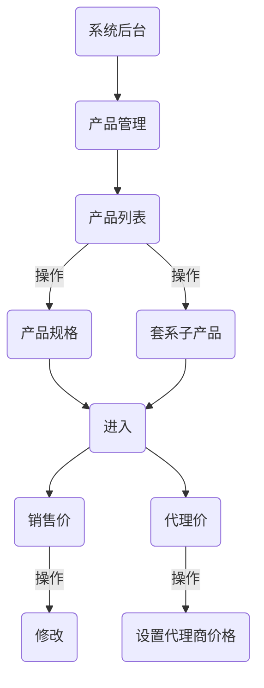

# 价格费用体系

> OPS系统定价涉及2个产品体系，每个产品体系所展现以及费用计算方式不同。

------

## 影像产品

?> 影像产品以商城形式进行下单销售，以下讲解OPS系统商城中销售产品价格相关设置。

### 产品价格展示

> 以下为商品示范展示，网站的模板不同而显示的效果不同。

商城价格展示

### 产品价格设置

> 进入系统后台，根据以下流程指引进行产品价格设置。

#### 设置流程示意

设置价格流程示意

#### 设置图文示例

1. 进入系统管理后台，选择所需设置的产品，选择【产品规格】。

?> 套系产品则选择【套系子产品】进行编辑

产品管理列表

2. 进行增加&设置价格信息；可修改售价与代理售价。

进行修改/增加

3. 新增&修改价格信息。

?> 添加商品与设置商品价格相同。 以下表单说明参见：[功能参数附加表](/zh-cn/TopicAdditionalTable?id=规格与套系后台管理)

    

增加或编辑

------

## 快印产品
?> 快印产品可以DIY形式可多选各项工艺进行下单，让客户拥有细节可控选项根据需求定制化自己所需求的产品。

快印产品价格费用体系已整理成为对应的专题文档，根据以下步骤可快速了解快印产品的价格费用体系设置与管理过程。

### 1、体验前端订购过程

> 详见[从下单到生产管理指引](/zh-cn/TopicQuickPrint-FromAddOrderToProduction)的[前端订购过程](/zh-cn/TopicQuickPrint-FromAddOrderToProduction?id=前端订购过程)。

### 2、了解产品属性和如何工作的

> 详见 [从零开始设置一个产品属性](/zh-cn/TopicQuickPrint-SetProductAttributes) 的 [产品属性是什么？](/zh-cn/TopicQuickPrint-SetProductAttributes?id=产品属性是什么？) [是如何工作的 ？](/zh-cn/TopicQuickPrint-SetProductAttributes?id=是如何工作的-？)

### 3、从零设置产品报价
> 详见专题：[从零设置产品报价](/zh-cn/TopicQuickPrint-SetProductQuotesFromZero)

### 附录：

1.[从零开始设置一个产品属性](/zh-cn/TopicQuickPrint-SetProductAttributes)

2.[从零发布一个产品](/zh-cn/TopicQuickPrint-AddNewProduct)

3.[从零设置产品报价](/zh-cn/TopicQuickPrint-SetProductQuotesFromZero)

4.[从下单到生产管理指引](/zh-cn/TopicQuickPrint-FromAddOrderToProduction)

5.[产品下单文件基本标准](/zh-cn/TopicBasicDocumentStandards)

Document creation time:2021-12-13   Update time:{docsify-updated} 
 