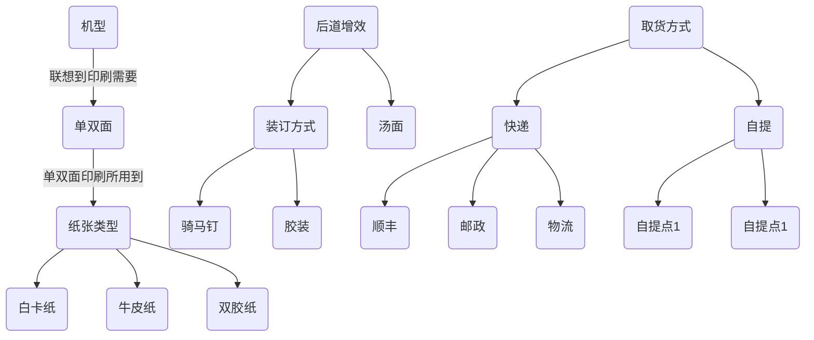

## 从零发布一个产品

> 在发布快印产品之前需要做好以下准备。

### 第一步：学习条件
> 需要已经掌握如何在[产品管理](/zh-cn/ProductManagement)中设置[产品属性](/zh-cn/ProductManagement?id=产品属性)信息 ，如果没有可以查阅[从零开始设置一个产品属性](/zh-cn/TopicQuickPrint-SetProductAttributes)

### 第二步：基础说明

> 产品的基础知识讲解与基础设置

###### 基础知识

当前产品为前台下单中所选择的产品选项，如下图：

<!-- tabs:start -->

<!-- tab:产品下单 -->

<!-- tabs:end -->
###### 基础设置

由于目前快印产品与影像产品使用同一个系统，现在快印产品需设置产品模块、产品分类（以后升级版本跳过此步骤）

<!-- tabs:start -->

<!-- tab:1.创建自定义产品模块 -->
> 如系统中已有`自定义产品`的模块可跳过此步骤
> 

<!-- tab:创建产品产品分类 -->
> 如系统中已有`自定义产品`模块的分类可跳过此步骤
> 

<!-- tabs:end -->

### 第三步：创建产品
下面示范创建一个**八开快印**产品示范的例子。

<!-- tabs:start -->
<!-- tab:1.进入产品管理 -->
>  **首先**进入产品管理，路径：系统后台->[产品管理](/zh-cn/ProductManagement)->[产品列表](/zh-cn/ProductManagement?id=产品列表)
>  

<!-- tab:2.进行添加产品 -->
> **例如**添加一个**八开快印**的产品，表单说明见：[商品基础信息表单](/zh-cn/TopicAdditionalTable?id=商品基础信息表单)

<!-- tab:3.进入规格管理 -->
> 设置产品规格信息，点击当前产品的`操作`中的`产品规格`进入如下图，点击`增加`。
> 

<!-- tab:4.添加设置规格 -->
> 快印产品只需完成设置如下三项表单即可。

!> 提交时如有错误提示，根据提示完善即可。不在下图的表单随便设置一下即可，新版将会只有以下设置。

<!-- tabs:end -->

### 第四步：自定义属性
创建完成产品的基本信息后，这里就需要进行设置产品属性`关联逻辑`。

下面使用**八开快印**产品的属性关联逻辑来示范如何操作。

<!-- tabs:start -->
<!-- tab:1.基础准备介绍 -->

**设计产品基本思路：**

1. 列出当前产品所需要的材料、工序、工艺、其它属性
2. 通过罗列产品所需要的产品属性进行关联拓展
3. 进行关系分组
4. 进行串联逻辑

**产品罗列示范：**

1. 设想当前**八开快印**产品所用到的[产品属性](/zh-cn/QuickPrint-SetProductAttributes?id=产品属性是什么？)

 所用到的属性有：机型、后道增效、纸张类型、颜色、取货方式、客户留言、工序……

2. 当前设想到的产品属延伸思路示范

3. 将关系进行分组

- 取货方式与其它属性无关 独立
- 客户留言 与其它属性无关 独立
- 机型、纸张类型、颜色 有关联
- ....

4. 串联起来设置产品属性

- 当印刷时 双面用到哪些纸张类型
- 当哪些纸张能用到哪些工艺，比如 半刀、对折……
- ...

<!-- tab:2.程序操作：解说1 -->

> 了解完第一步的基本思路，下面介绍程序的基本操作。

下图为产品属性逻辑功能截图。

使用方法与事项：
1. 双击A节点后再点击B节点可进行连线
2. 编辑连线条件后需提交保存
3. 拖动节点后保存可进行排序
4. 点击某节点后可在右边功能按钮进行编辑

<!-- tab:2.程序操作：解说2 -->

> 熟悉程序操作的解说1后下面进行深度了解节点(自定义属性)属性。

通过编辑属性或添加属性会有如下截图，表单说明见：[自定义属性表单说明](/zh-cn/TopicAdditionalTable?id=产品自定义属性表单)

<!-- tab:3.设置关联属性 -->

举例：机型颜色纸张关联

现在关联产品属性：`纸张类型`

在机型 `选择`纸张类型`所用`纸张种类`关联条件

那么产品自定义属性中如关联逻辑示意图如下视频设置：

[设置关联属性](/images/Topic/list1.mp4 ':include :type=video  controls width=100%')
<!-- tab:4.完成产品逻辑 -->

> 通过以上三步设置就完成一个产品，如下图：

<!-- tabs:end -->

### 结束语

> 通过以上学习已经熟悉管理一个产品，那我们下一步可以了解：[从零设置产品报价](/zh-cn/TopicQuickPrint-SetProductQuotesFromZero)

?> 提示：如需创建相同类似的产品可以直接在对应的产品`操作`中选择`拷贝`进行复制一份再进行编辑`自定义产品属性`逻辑。

Document creation time:2021-12-29   Update time:{docsify-updated} 
 