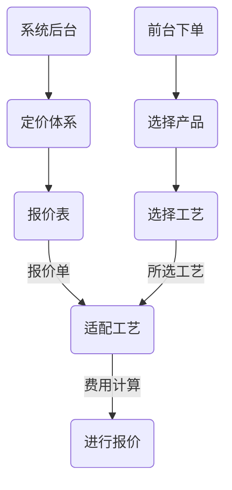
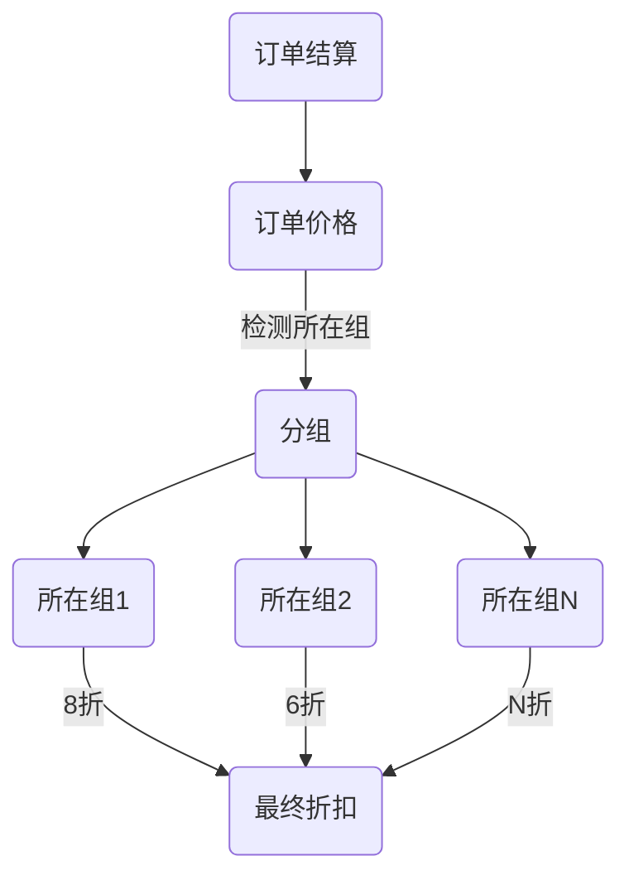
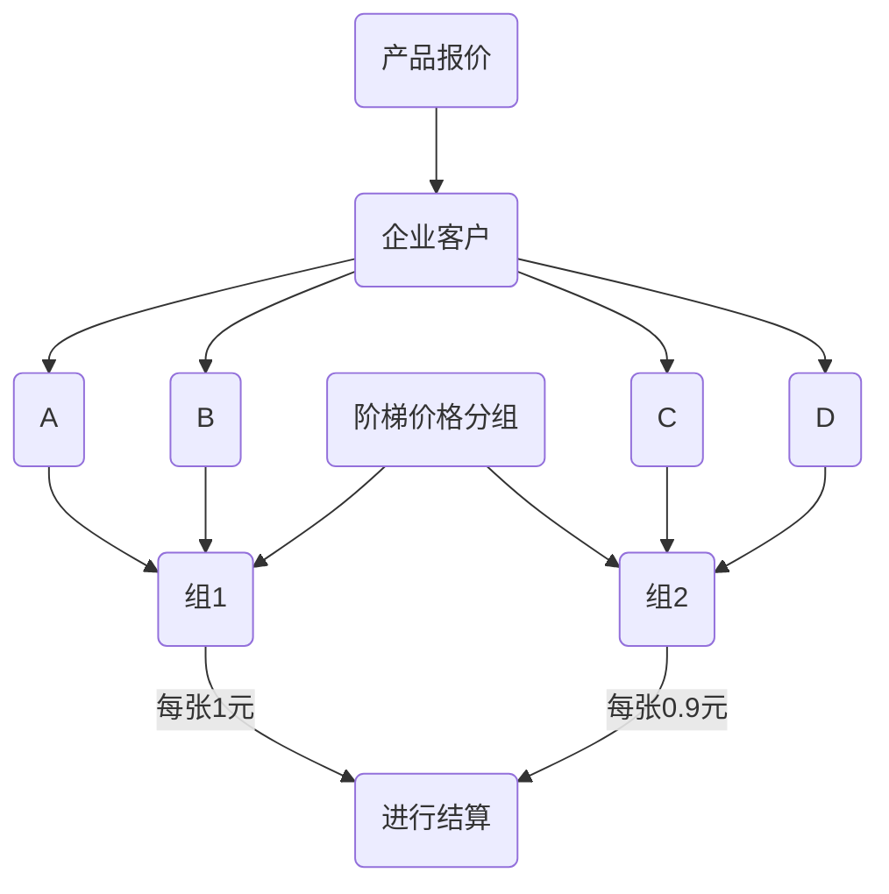

## 从零设置产品报价

> 快印产品的报价可以DIY形式可多选各项工艺进行下单，让客户拥有细节可控选项根据需求定制化自己所需求的产品。

### 一、基础了解
>  到了这里说明已掌握从[设置一个产品属性](/zh-cn/TopicQuickPrint-SetProductAttributes)到[发布产品](/zh-cn/TopicQuickPrint-AddNewProduct)，那么我们继续把整个流程贯穿进行设置产品报价 。

产品的最终报价涉及到**报价表**和当前账户的**优惠分组**、**阶梯价格分组**。

接下来，我们就围绕这些进行了解和学习。

**产品报价相关截图**
<!-- tabs:start -->

<!-- tab:前台价格展示 -->

<!-- tab:报价表后台展示 -->

<!-- tab:阶梯价格后台展示 -->

<!-- tab:优惠分组后台展示 -->

<!-- tab:阶梯价格分组后台展示 -->

<!-- tab:设置快印报价流程示意 -->

<!-- tabs:end -->
### 1.报价表的组成
##### 什么是报价单？

> 是根据产品或者产品相关连的工艺及自定义**属性**进行关联**组合**制定的**定价体系**规则称之为**多维度**组合报价。

**举例：**根据需可以将 【颜色+纸张克重+单双面】产品工艺进行创建多维度组合成一个**报价单**。

<!-- tabs:start -->
<!-- tab:报价单截图 -->

<!-- tab:多维度报价列表 -->

<!-- tabs:end -->

##### 什么是报价表？

> 报价表是有大量的报价单而形成的。

<!-- tabs:start -->
<!-- tab:报价表逻辑 -->

报价表费用计算功能示意

<!-- tab:报价表截图 -->

<!-- tabs:end -->

### 2.优惠分组
> 优惠分组是指可设置不同价格折扣组，可让更灵活的控制不同企业客户所享受的价格优惠。

举例：一些预存客户或者大客户在原有基础上进行打9折或者9.5折，那么就新建一个专属的原价上的折扣。
<!-- tabs:start -->

<!-- tab:优惠结算示意 -->

优惠分组结算逻辑示意

<!-- tab:优惠后台展示 -->

<!-- tabs:end -->

### 3.阶梯价格分组

> 阶梯价格分组可以将不同的企业客户进行不同的阶梯分组报价。

举例：

1. 阶梯价格有2个分组，价格分`组1` 的报价是1-99 每张1元。`分组2`的报价1-99份每张0.9元。
2. 有A,B,C,D四个客户，我们设置A,B客户为`分组1`、C,D客户为`分组2`，在同一个产品将执行不同的价格阶梯报价方式。
3. 如果当前用户没有特定分组，就会获取默认正常报价。

<!-- tabs:start -->
<!-- tab:阶梯价格分组结算示意 -->

阶梯价格分组报价示意

<!-- tab:阶梯价格分组后台展示 -->

<!-- tabs:end -->

### 二、开始设置

##### 1、创建一个报价单

举例：机型颜色纸张关联报价

现在关联三个产品属性：`机型`、`颜色`、`纸张类型`

在机型 `4开`选择不同`颜色`所用`纸张类型`产生不同的报价

<!-- tabs:start -->
<!-- tab:关联逻辑示意图 -->
如果[产品自定义属性](/zh-cn/QuickPrint-SetProductAttributes)中如下设置：

<!-- tab:创建一个报价单 -->
不同颜色所对使用的纸张不同，需要选择当前产品属性为 `印刷设备机型`、`颜色`、`纸张类型` 如`报价属性关联示意图` 。

<!-- tabs:end -->

##### 2、管理报价单

进入[管理报价表：设置关联价格规则](/zh-cn/PricingSystem?id=管理报价表：设置关联价格规则)，了解学习报价单相关设置。

##### 3、设置优惠分组

进入 [优惠定价分组管理设置](/zh-cn/PricingSystem?id=优惠定价分组)

##### 4、设置阶梯价格分组

进入 [阶梯价格分组管理设置](/zh-cn/PricingSystem?id=阶梯价格分组)

##### 5、了解 [默认价格库](/zh-cn/PricingSystem?id=默认价格库)

### 结束语
> 这节教程中的需要关联了解的地方比较多，需要重复阅读了解。

下一步：[从下单到生产管理指引](/zh-cn/TopicQuickPrint-FromAddOrderToProduction)

Document creation time:2021-12-29   Update time:{docsify-updated} 
 